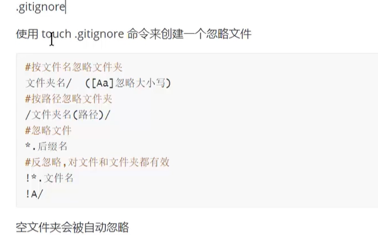
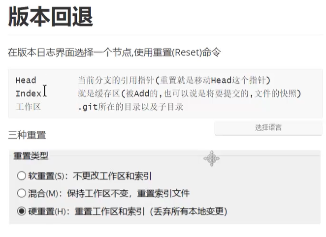

**一、Git本地仓库创建和一些基本概念**
1.使用**git init**命令创建本地仓库
2.仓库区和工作区
**·git文件夹为仓库区,**类似于一个数据库存储着每一次提交的变化
**·git所在目录称为工作区**，我们在这里创建项目，和其他文件
3.使用**git add<文件名>**可以把文件添加到**暂存区**，暂存区存储将要被提交的**文件变化**
4.使用**commit**命令提交暂存区存储的变化并生成一个新的版本
5.使用**git status**命令查看状态，**git log**命令查看日志

**二、Git服务器和远程仓库创建**
1.可以搭建，自己搭建git服务器
2.免费服务器
1.github.com全球最大开源项目托管平台
2.2.gitee.com国内知名开源项目托管平台码云
3.注册gitee账号，并创建仓库

**三、Git克隆**

1、https方式
1.第一次克隆需要我们输入账号密码
2、ssh方式
1.Ssh是一种开源非对称加密通信协议，
2.ssh只是一种协议，有开源实现也有商业实现，git默认使用开源实现
的openssh
3、ssh通信需要一对密钥（公和私一对）私钥留在自己电脑上，公钥给其
他的电脑
4、使用gitgui生成密钥，并把公钥放在服务器上
5、安装完第一次克隆会请求是否允许使用ssh，需要我们输入一
个"yes"

**四、添加，提交，推送，拉取**
①.添加add（如果使用使用小乌龟勾选即为add）
②.提交commit
1.提交只提交到本地仓库，需要推送才会到把变化更新到服务器仓库
③.推送push
1.如果服务器版本比我们新，会推送不成功需要先拉取
④.拉取pull
1.拉取时应确保**工作区整洁**，（都是绿色的文件，没有新添加的或者修改后的文件）

**五、分支**
1.master是仓库的主分，为了避免开发过程中程序员之间相互影响，我们一般选择创建一个新的分支来开发新功能
2.创建分支
3.切换分支
4.合并分支
**六、冲突**
 ①.冲突如何产生的
1.两个分支修改了同一个文件，合并的时候会发生冲突
②.如何解决冲突
1.协商修改冲突位置，并重新提交
③.如何减少冲突
1.先pull在修改
2.确保自己正在修改的文件是最新版本的
3.各自开发各自的模块，如果要修改公共文件，最好先确认有没有人正
在修改
④.不要擅自修改同事的代码

**七、忽略文件**

**八、版本回退**

**九、子模块**
子模块就是一个git仓库包含其他git仓库
当我们需要把其他开源项目作为本项目的一个库，并可以随时拉取更新的时候
或者我们的项目需要分模块独立开发项目的时候可以使用子模块
克隆有子模块的仓库，需要选择递归

**十、issue和PullRequest**
issue讨论
PullRequest拉取请求，为项目贡献代码，请求项目管理者合并自己的代码
git非常灵活可以根据自己的需要构思出来不同的工作流（团会开发的方式和流程)